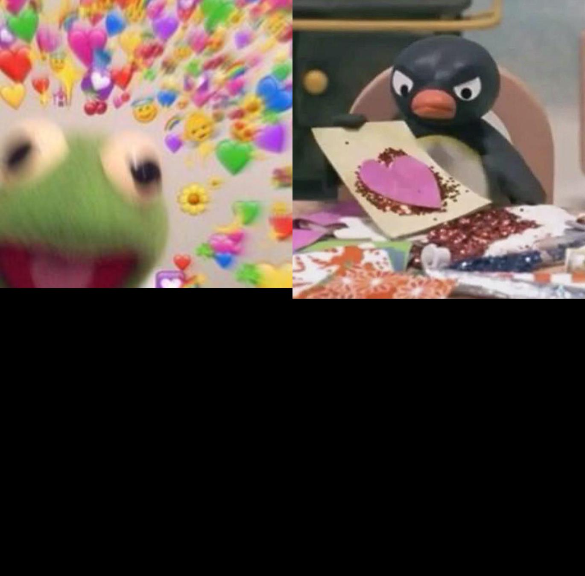
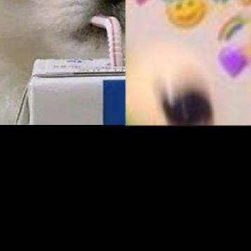
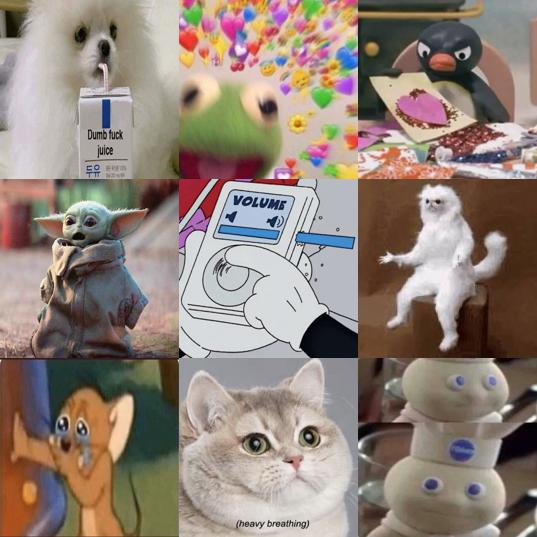
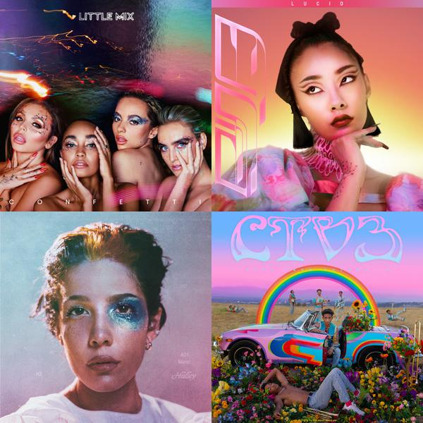

## Idea:
Have spotify autogenerate a profile photo based on the songs added (like it currently does), but this time it keeps scaling the photos so that it's always a n x n (square) cover photo

## NEED: 
1) Create a photo editor that takes in an array of 2n photos and outputs a n by n cover photo. 
2) Ability to connect to spotify 

## Development: 

### Latest status of the code: 

We have been able generate a photo that is a merge of two photos: 

Add now with the latest commit, we ensure images are the same size before merging: 

Realized, I don't want to crop things but actually resize them (otherwise some images are weirdly zoomed in). For the first two photos, I couldn't tell this since they are reasonable sizes. But by changing to resizing we can see the code becomes much less complex and the result is the same as the previous photo (but would be different if we had a really large photo)

For example, in the next commit, we add the logic to import all the photos. Now this results in the following image being made:

(note: this image is incorrect because it still only concates 2 photos -- we'll get to that later :smile, but it does show the difference between crop vs resize). 

If we had kept the cropping logic, since the image1 is so large, the crop would have cause a weird zoomed in effect, giving us this collage: 

Make the merged photo's size be relative to the number of photos in the array (i.e. if there are 4 photos, make the merged photo 2x2, if there are 6 photos, still make it be 2x2 until there are at least 9 photos (then make it 3x3)). This change gives us the same image as before so its still good :+1

Added some psuedo code for how adding the photos in matrix like pattern should work. For now, I've harded coded the placements for th 2x2 case and success! it looks beautiful: 
 

I got the matrix working!! and the results are the same as the hardcoded one so :tada! 

More images still look great! (even when some are odd shapes -- not square)

I've added the spotify api and am able to create an image of of hardcoded urls (I fetched from spotify)

### Next steps: 
Cleanup code and have the routes feed off each other better. 
Route suggestions: 
* `/playlist-items/<id>`: returns list of items from a given playlist
* `/photo-urls-from-playlist/<id>`: returns an array of unique photo urls for a given playlist
* `/make-photo-from-playlist/<id>`: returns a photo matrix of cover photos of the songs on a given playlist

The first two routes are for easy access to these data elements (seeing them if I need / want to). 

The third route is the purpose of our app! 

TODO: build out the POST route which adds the playlist image to the given playlist. then add this to the `/make-photo-from-playlist/<id>` route