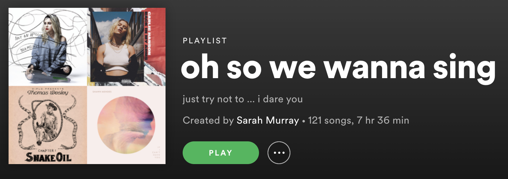

# Spotify Playlist Cover Photo Mosaic Tile Generator 
Take your favorite spotify playlist and make up to a 10x10 cover photo of unique albums on the playlist!

Why should your first four songs get all the spotlight? 

With this app you can turn this: 

Into this: 

## Running locally
- pull down this repo 
- [create an app via the spotify apps dashboard](https://developer.spotify.com/dashboard/login) (to generate a client id and client secret)
- touch an `.env` file in the root directory, adding your client id and secret there 
- declare the flask app `export FLASK_APP=server.py`
- run the app! `flask run`
    - if this causes an error try: `python3 -m flask run` instead
- run the UI locally to hit the API with the proper auth token.
- be sure to only make local requests over http, NOT https

## UI Repo: 
https://github.com/sarahmurraydev/playlist-cover-photo-geneator-ui